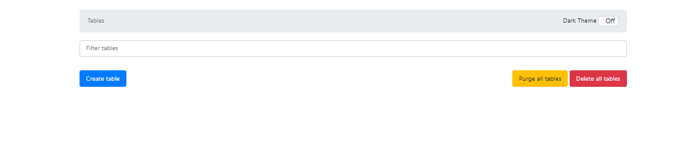
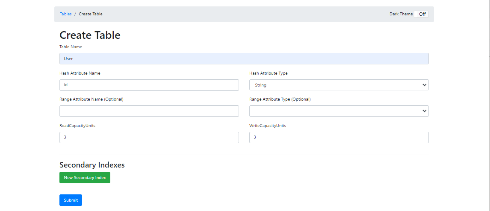
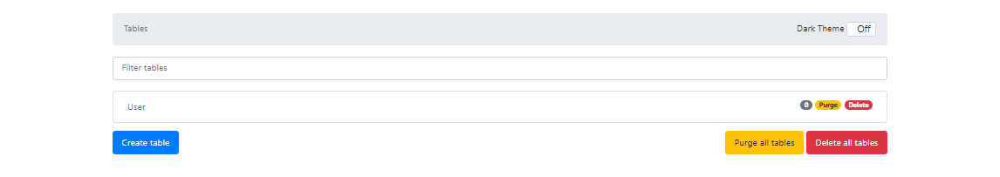
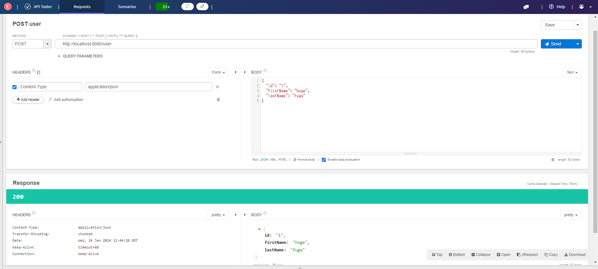
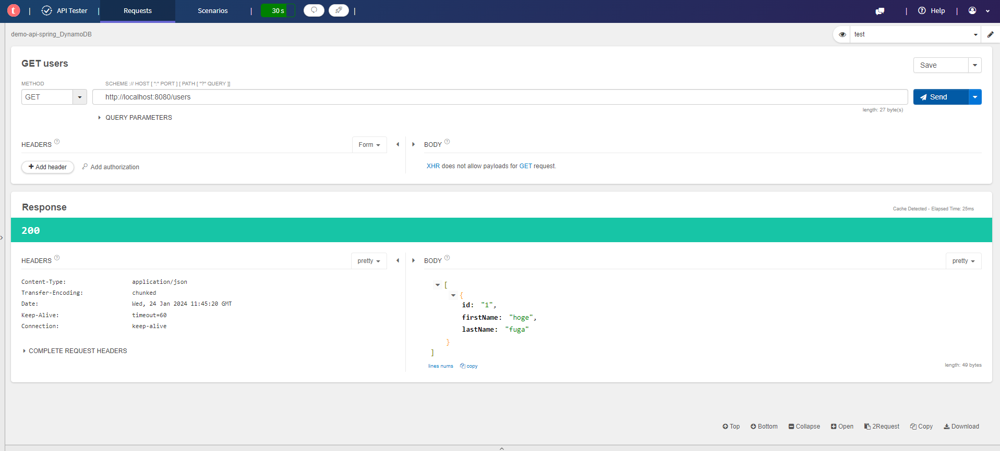
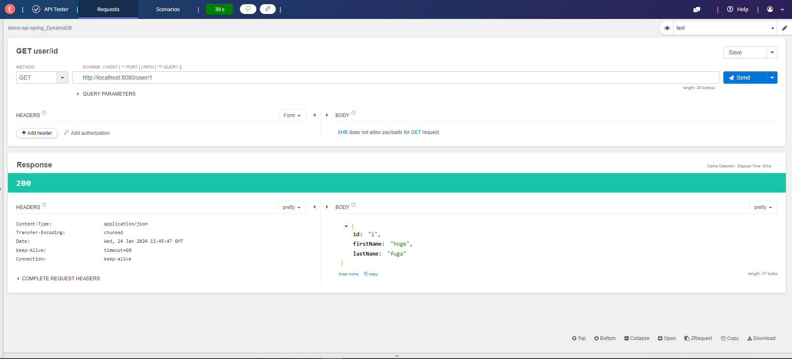

# dynamo-springboot-local

## 概要説明

### 
ローカル環境でSpringBoot - DynamoDBの開発環境を構築する

AWSに載せる予定のAPI開発をしようとした際に、AWSアカウント作成しなくても完全なローカル環境でDynamoDBを動かせるものを見つけたためCRAD処理ができるAPIを作成してみた。  
ローカルDynamoDB自体もDockerイメージで取得することができるため今回はSpringBoot, DynamoDB local, DynamoDB local GUIをDockerで動かす。  

### 環境情報  
SpringBoot 3.1.7  
Gradle 8.5  
Java 17  
Docker  

IDE :VSCode  
&ensp; 今回使用したVSの拡張機能は以下  
&ensp;&ensp; SpringBootでHello Worldできるくらいの拡張機能を追加  
&ensp;&ensp; lombokの拡張機能を追加する  
&ensp;&ensp; その他は不要  

DynamoDB local  
今回はDocker使うのでインストールはしない  
ダウンロードしたい方はここから取ることができます  
https://docs.aws.amazon.com/ja_jp/amazondynamodb/latest/developerguide/DynamoDBLocal.DownloadingAndRunning.html

# DynamoDBアクセスに関しての作り
- Repositoryクラスの@EnableScanがついているものをConfigクラスのDynamoDBConfig.javaにて、Beanにしてくれる  
- 接続関係もDynamoDBConfig.javaで実施してる  
- EntityクラスUser.javaのようにテーブル内容を記載する  
- application.propertiesにConfigクラスで使用するプロパティをまとめる  

### 動作方法
1. ソースをビルドする  
プロジェクトディレクトリで
```
./gradlew clean build;
```
2. dockerコンテナ起動
```
docker-compose up
```
3.  DynamoDBのTableを作成する  
DynamoDB localのGUIが存在しているので今回はそれを使用する。以下でアクセス。
```
http://localhost:8001/
```  
&ensp;&ensp;&ensp;
起動すると画像のような画面となる。  
&ensp;&ensp;&ensp;
Create tableボタンを押下する。


&ensp;&ensp;&ensp;Tabele Name: User  
&ensp;&ensp;&ensp;Hash Attibute Name: id  
&ensp;&ensp;&ensp;その他はデフォルトのままでsubmitボタンを押下  



&ensp;&ensp;&ensp;これでUserテーブルが作成された。  

&ensp;&ensp;&ensp;キー項目のみで生成しているため初めて触られる方はなんで?となるかもなので、最下部の※1に生成に関しての解説を記載しておきます。  

4.  APIを叩いて動作確認を行う
DynamoDB localのGUIが存在しているので今回はそれを使用する。以下でアクセス。
url直打ち、curlコマンド、Postman、APITesterなどで動作確認を実施する。  
以下はAPITester  

POST：INSERT
```
POST：http://localhost:8080/user  
body 
{
    "id":"1",
    "firstName”:”hoge",
    "lastName”:”fuga"  
}
```


SCAN：テーブル全件検索
```
GET：http://localhost:8080/users  
```



QUERY：キー検索
```
GET：http://localhost:8080/user/{id}  
```



今回疎通確認程度のためPUT,DELETEは省略しています。

4.  最後にコンテナを停止して完了
```
docker-compose down 
```


# 補足
※1 DynamoDBのテーブル作成について  
key-value型のNoSQLDBであり、テーブル作成時はキー項目のみの設定で作成する。  
本当に初めて触れた際に他項目はどうするんだと過去自身が思っていたため記載。  

- パーティションキー以外はオプションのため必須ではないが、LSIはテーブル作成時のみに設定できるので注意  
DynamoDB localにおいてはキーの追加方法は不明

- キーには以下がある  
Hash Attribute：パーティションキーのこと　必ず必須  
Range Attribute ：ソートキーのこと

Secondary Indexs  
LSI：ローカルセカンダリインデックス  
GSI：グローバルセカンダリインデックス  

RDBと違ってキー以外の項目はテーブル作成時に設定できないため  
例えば以下のような構成にしたい場合  
```
ゲームテーブル
ID：String：パーティションキー  
分類：String：ソートキー  
ゲーム名：String  
最終アクセス：Number  
```
生成する際は  
```
ID：String：パーティションキー
分類：String：ソートキー
```
のみでOK  

POST時（INSERT）で  
キーさえ入っていればOK
```
ID：String：パーティションキー
分類：String：ソートキー
ゲーム名：String
```
キー以外の項目が入っていてもOK
```
ID：String：パーティションキー
分類：String：ソートキー
ゲーム名：String
最終アクセス：Number
```
キーだけでもOK
```
ID：String：パーティションキー
分類：String：ソートキー
```

後からキー項目の追加はできないがそれ以外の項目に関しては後からデータ挿入時に追加されていても問題ない  


